# OPES-64 — how this was arrived at

Generated by `aif explain`. Every line below was written by a station
while it decided and is checked by that station gate — nothing here is
narrated after the fact. Regenerate it; do not edit it.

## Specification

```mermaid
flowchart LR
  T0("**A successful disconnect is unchanged.** `clear ` resolves, the side effects run, the sto…")
  T1("**The Monobank API rejects inside `connect`** — still quot;Connection Failed quot;; that p…")
  T2("**`clear` rejects** — nothing in the store moves, no side effect runs, the general sheet i…")
  T3("**`clear` resolves** — side effects run, status becomes `idle`.")
  T4("**`save` rejects inside `connect`** — the general sheet, not quot;Connection Failed quot;.")
  T5("A new general error sheet says ** quot;Something went wrong quot;**, and both a failed `cl…")
  T6("as it was — still `connected`, same `clientName`, same `accounts`, same `selectedAccountId…")
  T7("clear and the transactions reset — do not run, because the secret is still stored.")
  T8("resolves rather than rejecting, so the Disconnect button keeps handing the action straight…")
  T9("same `errorMessage`. There is no half-disconnected state")
  T10("they are not. The three tear-down side effects — `clearMonobankService`, the account-selec…")
  AC_001["AC-001 — the bottom-sheet store's `config.title` equals `Something we… → `Something went wron…"]
  AC_002["AC-002 — the bottom-sheet store's `config.variant` equals `error` → `error`"]
  AC_003["AC-003 — the store's `status` equals `connected` → `connected`"]
  AC_004["AC-004 — the store's `clientName` equals `Ada` → `Ada`"]
  AC_005["AC-005 — the store's `errorMessage` equals `prior-message` → `prior-message`"]
  AC_006["AC-006 — the length of the store's `accounts` equals 1 → 1"]
  AC_007["AC-007 — the store's `selectedAccountIds` contains `acc-1` → `acc-1`"]
  AC_008["AC-008 — the `clearMonobankService` call count equals 0 → 0"]
  AC_009["AC-009 — the `monobankAccountSelectionService.clear` call count equal… → 0"]
  AC_010["AC-010 — the `useTransactionsStore.reset` call count equals 0 → 0"]
  AC_011["AC-011 — the bottom-sheet store's `config.title` equals `Something we… → `Something went wron…"]
  AC_012["AC-012 — the settlement state of the promise returned by `disconnect … → `fulfilled`"]
  AC_013["AC-013 — the store's `status` equals `idle` → `idle`"]
  AC_014["AC-014 — the `clearMonobankService` call count equals 1 → 1"]
  AC_015["AC-015 — the `monobankAccountSelectionService.clear` call count equal… → 1"]
  AC_016["AC-016 — the `useTransactionsStore.reset` call count equals 1 → 1"]
  AC_017["AC-017 — the bottom-sheet store's `config.title` equals `Something we… → `Something went wron…"]
  AC_018["AC-018 — the bottom-sheet store's `config.title` equals `Connection F… → `Connection Failed`"]
  AC_019["AC-019 — the bottom-sheet store's `config.title` equals `Connection F… → `Connection Failed`"]
  AC_020["AC-020 — the store's `status` equals `error` → `error`"]
  AS_001{{"AS-001 — The new helper is exported from the bottom-sheet barrel as `showGenera…"}}
  AS_002{{"AS-002 — The general sheet reuses the existing `error` BottomSheetVariant rathe…"}}
  AS_003{{"AS-003 — Which sheet `connect` raises is decided by the step that failed, not b…"}}
  AS_004{{"AS-004 — The save branch of `connect` keeps writing the store state it writes t…"}}
  VG_001[/"VG-001 — Every criterion runs against a doubled monobankTokenService, so a gree…"/]
  VG_002[/"VG-002 — The failure is injected as a rejected promise from a double; no criter…"/]
  VG_003[/"VG-003 — The sheet is observed as the config handed to the bottom-sheet store, …"/]
  VG_004[/"VG-004 — Only the general sheet's title is pinned; its body text and button lab…"/]
  VG_005[/"VG-005 — What the user can do after a failed disconnect is not exercised: no cr…"/]
  T5 --> AC_001
  T6 --> AC_003
  T6 --> AC_004
  T9 --> AC_005
  T6 --> AC_006
  T6 --> AC_007
  T10 --> AC_008
  T10 --> AC_009
  T7 --> AC_010
  T2 --> AC_011
  T8 --> AC_012
  T3 --> AC_013
  T0 --> AC_014
  T0 --> AC_015
  T0 --> AC_016
  T4 --> AC_017
  T1 --> AC_018
  AS_002 -->|"exists only because of this"| AC_002
  AS_003 -->|"exists only because of this"| AC_019
  AS_004 -->|"exists only because of this"| AC_020
  AS_001 -.->|"rests on"| AC_001
  AS_001 -.->|"rests on"| AC_002
  AS_001 -.->|"rests on"| AC_011
  AS_001 -.->|"rests on"| AC_017
  VG_001 -.->|"leaves unproven"| AC_013
  VG_001 -.->|"leaves unproven"| AC_014
  VG_001 -.->|"leaves unproven"| AC_015
  VG_001 -.->|"leaves unproven"| AC_016
  VG_002 -.->|"leaves unproven"| AC_003
  VG_002 -.->|"leaves unproven"| AC_004
  VG_002 -.->|"leaves unproven"| AC_005
  VG_002 -.->|"leaves unproven"| AC_006
  VG_002 -.->|"leaves unproven"| AC_007
  VG_002 -.->|"leaves unproven"| AC_008
  VG_002 -.->|"leaves unproven"| AC_009
  VG_002 -.->|"leaves unproven"| AC_010
  VG_002 -.->|"leaves unproven"| AC_011
  VG_002 -.->|"leaves unproven"| AC_012
  VG_003 -.->|"leaves unproven"| AC_001
  VG_003 -.->|"leaves unproven"| AC_002
  VG_003 -.->|"leaves unproven"| AC_011
  VG_003 -.->|"leaves unproven"| AC_017
  VG_003 -.->|"leaves unproven"| AC_018
  VG_003 -.->|"leaves unproven"| AC_019
```

### Assumptions — the decisions the ticket did not make

**AS-001 — The new helper is exported from the bottom-sheet barrel as `showGeneralErrorBottomSheet`, and it owns the fixed title `Something went wrong` — neither call site passes a title.**

- the ticket left it open: the ticket says where the sheet lives and what its title reads, but names neither the export nor whether the title is a parameter.
- instead of: a title-taking helper that each call site defaults, which would let the two call sites drift to different words for the same failure.
- carries: AC-001, AC-002, AC-011, AC-017

**AS-002 — The general sheet reuses the existing `error` BottomSheetVariant rather than introducing a fourth variant.**

- the ticket left it open: the ticket calls it a general error sheet without saying how it renders, and BottomSheetVariant today offers `error`, `success` and `info`.
- instead of: adding a new variant member, which would pull useBottomSheetStore and GlobalBottomSheet into a change the ticket scopes to two files.
- carries: AC-002

**AS-003 — Which sheet `connect` raises is decided by the step that failed, not by the class of the thrown error: everything coming out of the Monobank API call keeps `Connection Failed`, including errors that are not MonobankError, and only a rejecting local `save` raises the general sheet.**

- the ticket left it open: the ticket separates a failed local write from a Monobank API failure, but `connect` today runs both through one catch that branches on `error instanceof MonobankError`.
- instead of: routing every non-MonobankError to the general sheet, which would silently move today's network-failure copy off `Connection Failed`.
- carries: AC-019

**AS-004 — The save branch of `connect` keeps writing the store state it writes today — status `error` with a message — and only the sheet it raises changes.**

- the ticket left it open: the ticket pins which sheet a failed `save` shows and says nothing about the store state that branch already writes.
- instead of: extending the disconnect rule — change nothing at all — to `connect`, which would leave the store at `connecting` after a save that will never complete.
- carries: AC-020

### What this cycle will not establish

- **VG-001** Every criterion runs against a doubled monobankTokenService, so a green suite would not establish that a resolved `clear` removed the token from the Keychain-backed store on a device. (leaves unproven: AC-013, AC-014, AC-015, AC-016)
- **VG-002** The failure is injected as a rejected promise from a double; no criterion reproduces a real condition under which `clear` fails, so nothing here establishes that a genuine Keychain failure rejects at all rather than resolving silently. (leaves unproven: AC-003, AC-004, AC-005, AC-006, AC-007, AC-008, AC-009, AC-010, AC-011, AC-012)
- **VG-003** The sheet is observed as the config handed to the bottom-sheet store, never as rendered output, so nothing here establishes that the user sees the general sheet or can dismiss it. (leaves unproven: AC-001, AC-002, AC-011, AC-017, AC-018, AC-019)
- **VG-004** Only the general sheet's title is pinned; its body text and button label are established by nothing in this cycle, because the ticket puts the rest of the copy out of scope. (leaves unproven: no criterion in particular)
- **VG-005** What the user can do after a failed disconnect is not exercised: no criterion presses Disconnect a second time, so recovery from the failure is unproven even though the store is left connected. (leaves unproven: no criterion in particular)

---

Drawn from:

- `spec.md` sha256 `5ac9430667e1ca922c63341a4c6a9e0bbbbc0a9f93edbb0ed27ca38e40868ca4`

If those no longer match the files, this drawing is stale — run `aif explain OPES-64` again.
